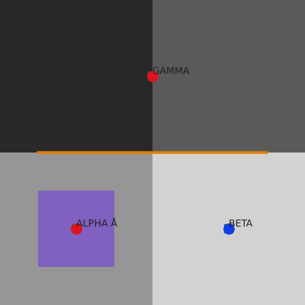

# Actual native fixture output

These PNGs were produced by the newly compiled owned QGIS/GeoServer runtimes,
not drawn as mockups. `combined.png` and the six layer-name images are native
PyQGIS authoring renders from `pyqgis-013`; engine-prefixed images are actual
HTTP response bodies from `maps-005`. Exact commands/source/artifact hashes
are in [the receipt](../../verification/native-renderer.json). Every image
uses synthetic redistributable coordinates and attributes, EPSG:4326 extent
0–4, 512×512 pixels and the declared renderer profile.

| Native path | Actual output |
|---|---|
| GeoServer categorized markers | [PNG](geoserver-categorized.png) |
| QGIS Server categorized markers | [PNG](qgis-server-categorized.png) |
| QGIS Server expression labels | [PNG](qgis-server-labels.png) |
| QGIS Server grayscale raster | [PNG](qgis-server-raster.png) |

The tests independently check known feature positions/colors, visible labels,
quadrant raster values and measured pixel differences. The combined image is
for inspection; individual-layer comparisons establish the reported fidelity.
The authoring images use offscreen native PyQGIS, not a physical desktop UI
or Windows session. Font files and raw private runtime profiles are not embedded.
